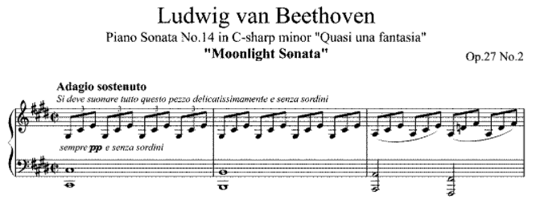
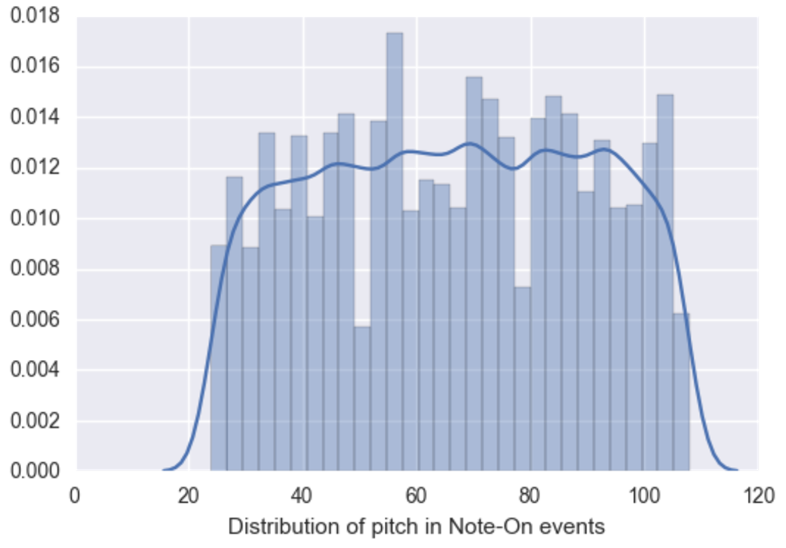
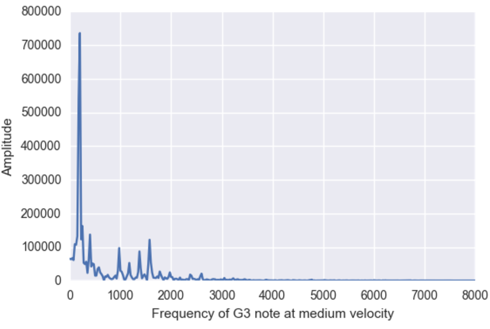
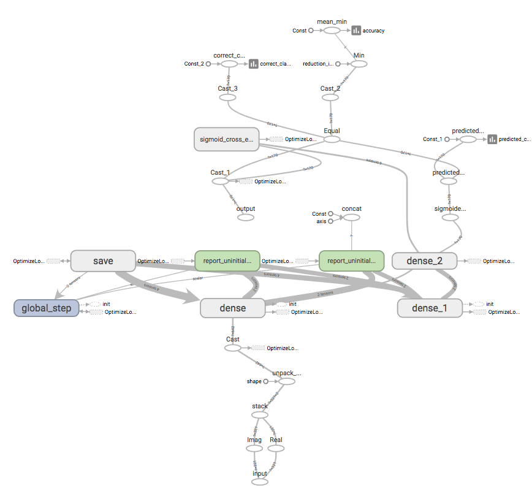
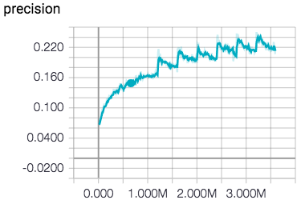
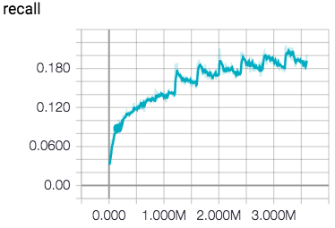
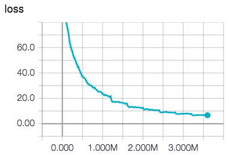
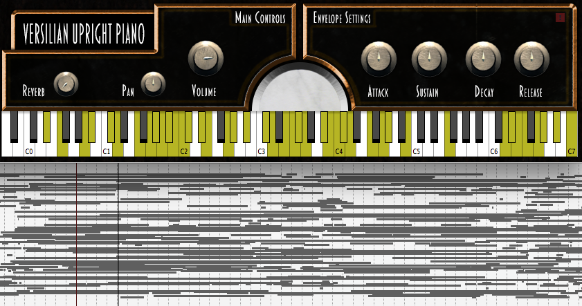
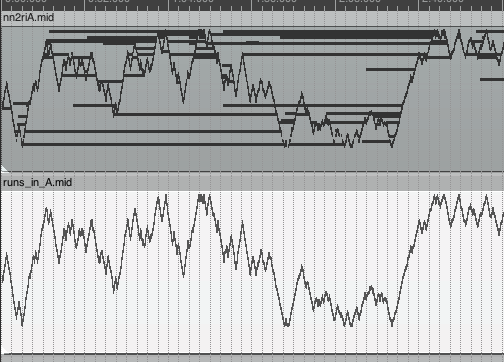
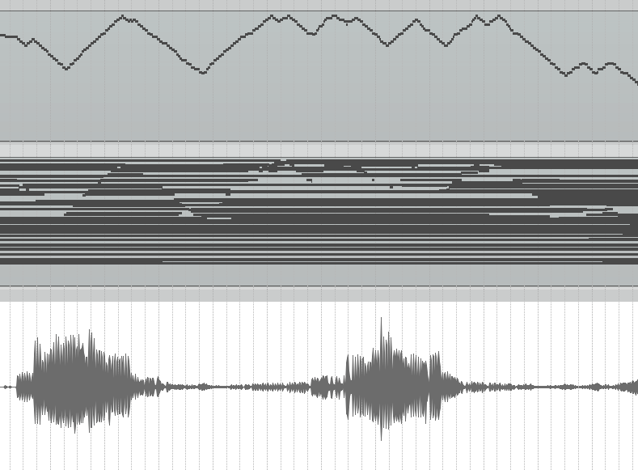

# Machine Learning Engineer Nanodegree

## Capstone Project

Justin Todd<br>\newline
June 2, 2017

## I. Definition

### Project Overview

Automated musical transcription is the process of having a machine process a
recorded piece of music and turn it into a digital format which encapsulates
the piece in a more musical form. This more musical form should be enough to
act as an instruction list which, when followed, is enough to reproduce the
original piece of music.

Traditionally music is transcribed in a visual manor with symbols indicating
pitch, key signature, and note duration along with any additional accents and
notes which might be required by the human performer of the piece. For
machines to understand a transcription of music there is another story. MIDI
(short for Musical Instrument Digital Interface) is a technical standard for
describing similar musical information, but which can more easily interpreted
by machines.



Instead of note durations and measures, MIDI (at least for the subset of the
format which we are focused on today) involves a list of messages and the
number of "ticks" at which those messages occur in the musical track.
A single, typical message may encompass the following information: note on at
tick 400, pitch 24, velocity 64. This translates to: Play a low C 0.92
seconds into the track at a medium volume.

<!--
another machine could use the instructions to be able to reporoduce the piece
of music.
In this section, look to provide a high-level overview of the project in layman’s terms. Questions to ask yourself when writing this section:
- _Has an overview of the project been provided, such as the problem domain, project origin, and related datasets or input data?_
- _Has enough background information been given so that an uninformed reader would understand the problem domain and following problem statement?_
-->

### Problem Statement

The goal is to be take a digital recording of a piece of monophonic piano
music and produce a MIDI track which is able to reproduce the original music.

The tasks involved are like so:

1. Generate a midi track which simulates some measure of musicality which
   incorporating a lot of randomness.
2. Use the generated MIDI track and a virtual piano instrument to create a
   simulated digital recording of a piano to use as a digital signal for
   input.
3. Process the digital signal and the generated MIDI track into features and
   labels which can be used for training a model.
4. Build and train the classifier.
5. Have the trained classifier analyze a recorded piece of music, produce a
   MIDI track, and use a virtual piano to create a digital recording.

<!--
In this section, you will want to clearly define the problem that you are trying to solve, including the strategy (outline of tasks) you will use to achieve the desired solution. You should also thoroughly discuss what the intended solution will be for this problem. Questions to ask yourself when writing this section:
- _Is the problem statement clearly defined? Will the reader understand what you are expecting to solve?_
- _Have you thoroughly discussed how you will attempt to solve the problem?_
- _Is an anticipated solution clearly defined? Will the reader understand what results you are looking for?_
-->

### Metrics

Accuracy is a common metric for binary classification, but in this problem is
not a good metric because most of the frames of music we are analyzing contain
no events--they are merely space between note stops and starts. Accuracy
is defined as the sum of true positives and true negatives divided by the
size of the dataset. In this case a classifier which never chooses any class
for a given frame of music tends to have a higher than 99% accuracy.

Therefore we will be looking at precision for the primary metric of this task
and recall as an auxiliary metric.

Precision is the number of true positives divided by the sum of true positives
and false positives.

Recall is the number of true positives divided by the sum of true positives
and false negatives.

Precision is chosen as it will tend to favor making sure the notes chosen are
correct. This may lead to the correct notes not being chosen at all, but
false positives are more damaging to the result as wrong notes result in
cacophonous music.

Recall is also being tracked as it can show if notes are being missed, but I'm
greatly favoring precision in this case because I am saying it is better to
stay in key than miss some notes.

<!--
In this section, you will need to clearly define the metrics or calculations you will use to measure performance of a model or result in your project. These calculations and metrics should be justified based on the characteristics of the problem and problem domain. Questions to ask yourself when writing this section:
- _Are the metrics you’ve chosen to measure the performance of your models clearly discussed and defined?_
- _Have you provided reasonable justification for the metrics chosen based on the problem and solution?_
-->


## II. Analysis
<!-- _(approx. 2-4 pages)_ -->

### Data Exploration
<!--
In this section, you will be expected to analyze the data you are using for the problem. This data can either be in the form of a dataset (or datasets), input data (or input files), or even an environment. The type of data should be thoroughly described and, if possible, have basic statistics and information presented (such as discussion of input features or defining characteristics about the input or environment). Any abnormalities or interesting qualities about the data that may need to be addressed have been identified (such as features that need to be transformed or the possibility of outliers). Questions to ask yourself when writing this section:
- _If a dataset is present for this problem, have you thoroughly discussed certain features about the dataset? Has a data sample been provided to the reader?_
- _If a dataset is present for this problem, are statistics about the dataset calculated and reported? Have any relevant results from this calculation been discussed?_
- _If a dataset is **not** present for this problem, has discussion been made about the input space or input data for your problem?_
- _Are there any abnormalities or characteristics about the input space or dataset that need to be addressed? (categorical variables, missing values, outliers, etc.)_
-->

The data set for this project was generated in whole by a script that I wrote.
The method for generating the music is an attempt to get enough coverage of
pitches and velocities while trying to imitate musicality. Music is typically
composed within scales. A scale is usually comprised of 7 notes per octave.
So I set off to generate random notes within scales and close to each other
pitch-wise by "running" through the scales and randomly changing the direction
of the run.

The script worked like so:

```
let d be a direction (up or down) in which to run the scale
for each scale:
    for each tick duration:
        emit 100 notes like so:
            while cycling through velocities in a sine wave,
            stop the previous note (if there is one)
            start the next note of the scale in direction d
            randomly with probability 0.1 change direction of d
```

The following tick durations were used (a tick is 2.3ms in this project):
40, 60, 80, 150, 200

The following scales and arpeggios were used to generate notes:
Chromatic (every note), major, major 3rd arpeggios, 7-chord arpeggios, major 7
arpeggios, major-minor 7 arpeggios, minor, minor harmonic scale, minor
arpeggios, whole tone scale, octatonic diminshed scale, augmented, fifths,
octaves, minor pentatonic, major pentatonic, and the blues scale.

The MIDI files were run through a piano virtual instrument to produce audio.
[VS Upright No. 1][upright] is a free virtual instrument provided by Versilian
Studios which was used for the audio.
The audio was then downsampled using [Sound eXchange](http://sox.sourceforge.net/)
to 16,000 samples per second.

[upright]: http://vis.versilstudios.net/upright-1.html
[2]: https://www.wikiwand.com/en/Fast_Fourier_transform

<!-- - Runs in A contains 45,000 note-on events and 45,000 note-off events. -->
<!-- - G3 is a 1 at index 19 -->


### Exploratory Visualization
<!--
In this section, you will need to provide some form of visualization that summarizes or extracts a relevant characteristic or feature about the data. The visualization should adequately support the data being used. Discuss why this visualization was chosen and how it is relevant. Questions to ask yourself when writing this section:
- _Have you visualized a relevant characteristic or feature about the dataset or input data?_
- _Is the visualization thoroughly analyzed and discussed?_
- _If a plot is provided, are the axes, title, and datum clearly defined?_
-->

The primary file used in this project is "Runs in A". The track contains
45,000 note-on events and 45,000 note-off events. The distribution plot below
indicates that my method for generating the data while trying to imitate
musicality as resulted in a fairly uniform distribution of pitches. This, we
have an ample data set to train and test from.



### Algorithms and Techniques

<!--
In this section, you will need to discuss the algorithms and techniques you intend to use for solving the problem. You should justify the use of each one based on the characteristics of the problem and the problem domain. Questions to ask yourself when writing this section:
- _Are the algorithms you will use, including any default variables/parameters in the project clearly defined?_
- _Are the techniques to be used thoroughly discussed and justified?_
- _Is it made clear how the input data or datasets will be handled by the algorithms and techniques chosen?_
-->

The data will be preprocessed by dividing the music into 40ms frames of
frequency centers and magnitudes for use as features and note on/off events to
use as labels. The frequency centers and magnitudes are obtained using a fast
Fourier transform. See [Data Preprocessing](#datapre) for more details.

The classifier being used is a simple
[Artificial Neural Network](https://www.wikiwand.com/en/Artificial_neural_network) (ANN).

An artificial neural network is modelled after the brain. Similar to how
neurons send and receive signals via synapses, a neuron in an ANN receives
many different inputs simultaneously and sends a signal to other neurons
depending on that value. Neurons in an ANN are grouped into layers. Each
neuron in a layer sends its output to each neuron in the next layer. The
output signal of a neuron is determined by taking all of the input values from
the previous layer, mathematically combining them with a set of
randomly initialized weights, and passing the single resulting scalar value
through an "activation function."  The activation function typically bounds
the resulting signal between 0 and 1.

The final layer in the ANN will be a single vector which contains exactly as
many classes as we have to predict. The value for each class is the
probability that that class is true. A class in this case represents the
pitch of the note and whether it is being turned on or off.
We will use some threshold to determine if we will actually count
that as a prediction of that class or not (in this project, the threshold was
0.5).

At the end of a single iteration, the loss is calculated. Loss is a
representation of by how far off the prediction is. The weights for each
layer are then incrementally updated using some small learning rate in order
to try to minimize the loss. This process is repeated through many, many
iterations until the final loss is low. This should result in a high precision
for our classifier.

See [Implementation](#implementation) for more details on the neural network.

Parameters which can be tuned to optimize the classifier:

- Classification threshold (at what probability we choose to assign the class)
- Number of epochs to train
- Batch size (frames to look at per training step)
- Solver type (algorithm for learning)
- Learning rate

### Benchmark
<!--
In this section, you will need to provide a clearly defined benchmark result or threshold for comparing across performances obtained by your solution. The reasoning behind the benchmark (in the case where it is not an established result) should be discussed. Questions to ask yourself when writing this section:
- _Has some result or value been provided that acts as a benchmark for measuring performance?_
- _Is it clear how this result or value was obtained (whether by data or by hypothesis)?_
-->

This project is very much an exploration of the space -- using neural networks
for transcription. As such, I don't have a solid threshold other than
watching the precision of the classifier continue to increase. The other
non-scientific metric is that I periodically use the classifier to turn a wave
file into MIDI, re-render it to audio, and gauge my own satisfaction with the
results. As someone who has been a musician for more than 17 years, I have a
fairly well-trained ear.

If I had to put an actual benchmark, I would like to have a precision of 80%.
That would mean a transcriber using this as a tool would be only need to
correct 20%. It's completely arbitrary though.


## III. Methodology
<!-- _(approx. 3-5 pages)_ -->

### Data Preprocessing {#datapre}
<!--
In this section, all of your preprocessing steps will need to be clearly documented, if any were necessary. From the previous section, any of the abnormalities or characteristics that you identified about the dataset will be addressed and corrected here. Questions to ask yourself when writing this section:
- _If the algorithms chosen require preprocessing steps like feature selection or feature transformations, have they been properly documented?_
- _Based on the **Data Exploration** section, if there were abnormalities or characteristics that needed to be addressed, have they been properly corrected?_
- _If no preprocessing is needed, has it been made clear why?_
-->

Music is just sound. Sound is fluctuations in air pressure. The sounds in
this project are stored in their base form as waveform audio files (waves).
These waves are converted into a lists of features by slicing the wave into
short segments then performing the fast fourier transform on them.

##### Frame:

I'm using this term to denote a short period which is used to generate a
single feature set and class set. The time frame used in this project is 40ms
as it is shorter than the shortest notes generated.

##### Wave files:

A wave file a discrete sampling of the amplitude of the audio signal. The
wave files used in this project have 16,000 samples per second. Using a time
frame of 40ms means each frame represents 640 samples of the audio signal.

##### Fast Fourier transform (FFT)

The fast Fourier is an algorithm for computing the discrete Fourier transform
of a signal. In short, this turns the wave signal into a list of frequency
centers and their amplitudes, known as a spectrum. Fourier analysis is used
heavily in signal processing and is an excellent use case for feature
generation as it gives good separation of lower and higher frequencies
(pitches in this case). An FFT transformation for 640 samples of audio results
in 321 values.

Since the resulting values of the FFT are complex, they were converted into
tuples of floats, then flattened out. This created 2 times the number of
features.

All these factors result in 642 features per 40ms "frame" of audio.

Below is a visualization of the spectrum of the first note in "Runs in A"
which is a G in the third octave:



#### MIDI

Midi events for each frame were turned into boolean values over 170 classes.
The classes are all pitches from C2 to C9 inclusive and whether the note is
turned on and whether the note is turned off.

### Implementation {#implementation}
<!--
In this section, the process for which metrics, algorithms, and techniques that you implemented for the given data will need to be clearly documented. It should be abundantly clear how the implementation was carried out, and discussion should be made regarding any complications that occurred during this process. Questions to ask yourself when writing this section:
- _Is it made clear how the algorithms and techniques were implemented with the given datasets or input data?_
- _Were there any complications with the original metrics or techniques that required changing prior to acquiring a solution?_
- _Was there any part of the coding process (e.g., writing complicated functions) that should be documented?_
-->

Data processing was implemented in the manor I described above using a custom
script. The script uses the [numpy](http://www.numpy.org/) and
[scipy](https://www.scipy.org/) libraries for array and wave form
operations. The script usues the
[python-midi](https://github.com/vishnubob/python-midi) library for reading
and creating midi files.

The classifier uses the [TensorFlow](https://www.tensorflow.org/) library for
building, running, and visualizing. I also make heavy use of the
[tensorflow.contrib.learn](https://www.tensorflow.org/get_started/tflearn)
module for a bit simpler programming interface.

Below is an overly complex diagram of the network.



##### Input layer

The first step is unpacking the complex number. The pre-processing step stores
the features as 128-bit complex numbers, so I unpack them into the 642-feature
structure that I specified in the data processing section and cast them to
32-bit floats.

##### Dense layer

The next (hidden) layer is a 512-neuron, fully connected layer. This operates
in the classic nerual-netowrk style of multiplying randomly initialized
weights by the input features, adding a bias vector, and passing the result
through an activation function.

The activation function in this case is a
[rectifier](https://www.wikiwand.com/en/Rectifier_(neural_networks))
(ReLU for "rectified linear unit"). A rectifier is ideally linear (f(x) = x)
for all x > 0, but 0 otherwise.

Rectifier approximation:
$$ f(x) = ln(1 + e^x) $$

#### Output layer

At this point the outputs from the dense hidden layer is fed into another
dense layer which operates the same as the hidden layer except:

1. It has exactly as many neurons as there are classes to classify (170).
2. It uses a simple linear activation function.

#### Loss

Since this is a model for a multi-label classifier, softmax is ineffective.
So instead I use a sigmoid cross-entropy loss function on the result of the
output layer, crossed with the true labels for the feature.

Optimization is handled by `tf.contrib.layers.optimize_loss` which uses
stochastic gradient descent and a constant learning rate of 0.001 to minimize
loss.

#### Evaluation

Every 50,000 iterations training is stopped to evaluate against testing data.
Precision and recall for the validation set are recorded at this point.
At the end of an epoch, the metrics are manually evaluated and the classifier
is restarted.

Periodically a wave file is processed and passed through the classifier to
visually and audibly inspect the resulting MIDI.

### Refinement
<!--
In this section, you will need to discuss the process of improvement you made upon the algorithms and techniques you used in your implementation. For example, adjusting parameters for certain models to acquire improved solutions would fall under the refinement category. Your initial and final solutions should be reported, as well as any significant intermediate results as necessary. Questions to ask yourself when writing this section:
- _Has an initial solution been found and clearly reported?_
- _Is the process of improvement clearly documented, such as what techniques were used?_
- _Are intermediate and final solutions clearly reported as the process is improved?_
-->

The model described above is the final model. I had some frustrating
experience while learning to use tensorflow and had some experiments which
purely did not work. I think they were due to faulty implementations on my
part, which is why I came back to a simpler model. My recurrent neural
net wouldn't optimize. Attempting to run a convolutional net on series of
frames wouldn't even run.

One experiment in the same line as the final model was to use a deeper
network. I opted for 200 x 100 x 100-neuron hidden layers instead of the one
512-neuron layer I have. It had lower precision and recall scores and did not
converge on a low loss nearly as fast as the current model.


## IV. Results
<!-- _(approx. 2-3 pages)_ -->

### Model Evaluation and Validation
<!--
In this section, the final model and any supporting qualities should be evaluated in detail. It should be clear how the final model was derived and why this model was chosen. In addition, some type of analysis should be used to validate the robustness of this model and its solution, such as manipulating the input data or environment to see how the model’s solution is affected (this is called sensitivity analysis). Questions to ask yourself when writing this section:
- _Is the final model reasonable and aligning with solution expectations? Are the final parameters of the model appropriate?_
- _Has the final model been tested with various inputs to evaluate whether the model generalizes well to unseen data?_
- _Is the model robust enough for the problem? Do small perturbations (changes) in training data or the input space greatly affect the results?_
- _Can results found from the model be trusted?_
-->

This model is terrible, but I simply ran out of time to continue improving it
and/or learning TensorFlow. The model can understand low notes vs high notes
pretty well, but that's about it.

I predicted a live rendition of Beethoven's Moonlight Sonata... Shameful.

Here's the prediction of "Runs in A" on the right channel with the original on
the left channel:  <https://soundcloud.com/bobisme/final-training>
A visualization of this can be seen in the conclusion section of this paper.

Here are the final graphs of the metrics used.








### Justification
<!--
In this section, your model’s final solution and its results should be compared to the benchmark you established earlier in the project using some type of statistical analysis. You should also justify whether these results and the solution are significant enough to have solved the problem posed in the project. Questions to ask yourself when writing this section:
- _Are the final results found stronger than the benchmark result reported earlier?_
- _Have you thoroughly analyzed and discussed the final solution?_
- _Is the final solution significant enough to have solved the problem?_
-->

This super simple neural net did learn some basic things like how to only
predict one or two notes at a time. It learned high notes and low notes.

This problem is not solved by this model.


## V. Conclusion
<!-- _(approx. 1-2 pages)_ -->

### Free-Form Visualization
<!--
In this section, you will need to provide some form of visualization that emphasizes an important quality about the project. It is much more free-form, but should reasonably support a significant result or characteristic about the problem that you want to discuss. Questions to ask yourself when writing this section:
- _Have you visualized a relevant or important quality about the problem, dataset, input data, or results?_
- _Is the visualization thoroughly analyzed and discussed?_
- _If a plot is provided, are the axes, title, and datum clearly defined?_
-->

Below is a screenshot of the virtual instrument used to generate the audio for
this project above the MIDI result from using a poor classifier. The MIDI
file is very cluttered and noisy. This is the result of near-randomly
predicted notes.



<!--  -->

Below is a screenshot of using the classifier. You can see many
incorrectly sustained notes (long horizontal lines). But you can see a noisy
shape which mimics the curve of the actual notes:



### Reflection
<!--
In this section, you will summarize the entire end-to-end problem solution and discuss one or two particular aspects of the project you found interesting or difficult. You are expected to reflect on the project as a whole to show that you have a firm understanding of the entire process employed in your work. Questions to ask yourself when writing this section:
- _Have you thoroughly summarized the entire process you used for this project?_
- _Were there any interesting aspects of the project?_
- _Were there any difficult aspects of the project?_
- _Does the final model and solution fit your expectations for the problem, and should it be used in a general setting to solve these types of problems?_
-->

The process for addressing this problem involved:

1.  Generating and rendering MIDI renditions of musical passages and their
    WAV-file recording counterparts.
2.  Processing that data into 40ms frames of note on/off events to use as
    labels and a Fourier transform of the sound wave into a frequency-space
    representation of the data to use as a feature set.
3.  Splitting the data into randomized training/testing sets.
4.  Running that data through a simple artificial neural network with a single
    hidden layer and minimizing the loss.
5.  Testing the result by using the predictions of the classifier against the
    true values in the testing set.
6.  Manually inspecting the result by rending the predicted MIDI to an audio
    file.

This project was the first step in a longer term project of training a network
to understand features of music generally.

This has been a fantastic project. Music has been a large part of my life for
more than half of it. I finally got to build a neural network that dose
something I wanted to try, and I finally got to learn TensorFlow. There was a
lot of frustration there too due to some under-documented contrib modules.

This final solution is not great, but I think the idea of using neural nets
for this task has promise. I think the right kind of neural net would do much
better.

### Improvement
<!--
In this section, you will need to provide discussion as to how one aspect of the implementation you designed could be improved. As an example, consider ways your implementation can be made more general, and what would need to be modified. You do not need to make this improvement, but the potential solutions resulting from these changes are considered and compared/contrasted to your current solution. Questions to ask yourself when writing this section:
- _Are there further improvements that could be made on the algorithms or techniques you used in this project?_
- _Were there algorithms or techniques you researched that you did not know how to implement, but would consider using if you knew how?_
- _If you used your final solution as the new benchmark, do you think an even better solution exists?_
-->

I think a more complex and more modern network would do much better.
A recurrent net or a convolutional net (or a combination of the two) could be
astounding. One thing I should have tried was feature scaling. I think that
caused some strange errors in other models I abandoned.

<!-----------------------------------------------------------------------------
**Before submitting, ask yourself. . .**

- Does the project report you’ve written follow a well-organized structure similar to that of the project template?
- Is each section (particularly **Analysis** and **Methodology**) written in a clear, concise and specific fashion? Are there any ambiguous terms or phrases that need clarification?
- Would the intended audience of your project be able to understand your analysis, methods, and results?
- Have you properly proof-read your project report to assure there are minimal grammatical and spelling mistakes?
- Are all the resources used for this project correctly cited and referenced?
- Is the code that implements your solution easily readable and properly commented?
- Does the code execute without error and produce results similar to those reported?
-->
